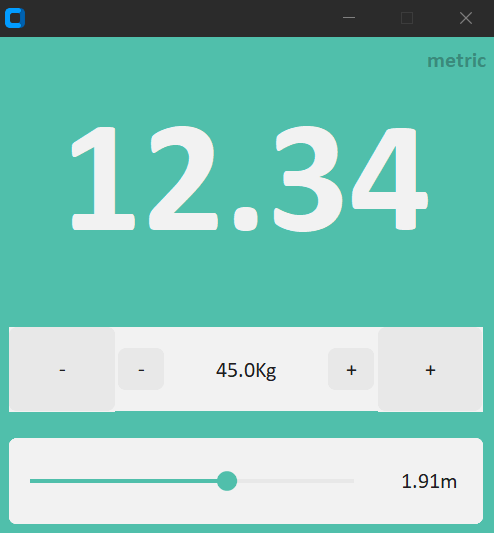

This simple Python program calculates your Body Mass Index (BMI), a measure of body fat based on height and weight. It provides a quick assessment of whether you are underweight, normal weight, overweight, or obese.

Key Features

User-friendly input: Guides you to enter your height in meters and weight in kilograms.
Accurate BMI calculation: Applies the standard BMI formula (weight / height^2) to calculate your BMI value.
Clear interpretation: Indicates your weight category based on standard BMI ranges:
Underweight: BMI less than 18.5
Normal weight: BMI between 18.5 and 24.9
Overweight: BMI between 25 and 29.9
Obese: BMI 30 or greater
Python accessibility: Written in Python for easy understanding and modification.
Usage

Run the program: Execute the Python script (e.g., python bmi_calculator.py).
Enter your height: Provide your height in meters when prompted.
Enter your weight: Provide your weight in kilograms when prompted.
View results: The program will display your calculated BMI value and its corresponding weight category.

